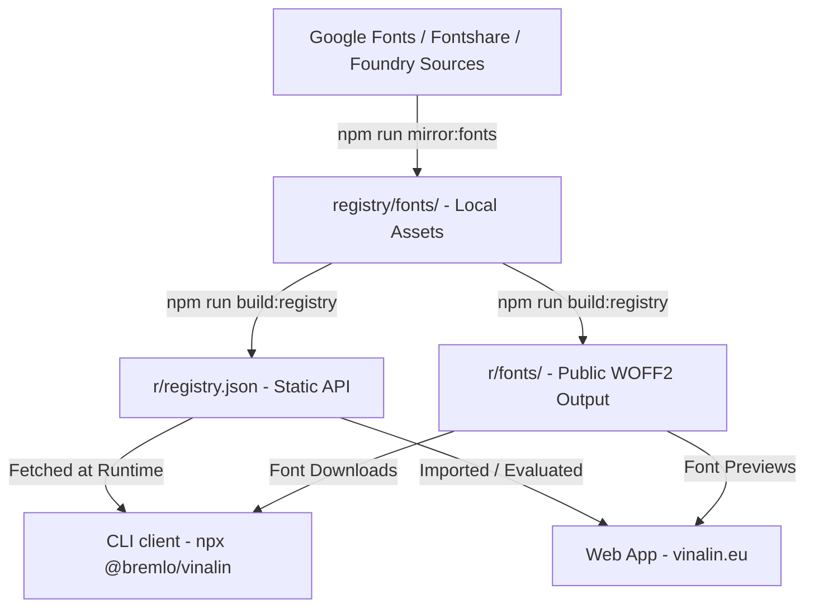

# vinalin ── Curated Type Library & Self-Hosted Font CLI

<p align="center">
  <a href="https://vinalin.eu">
    
  </a>
</p>

<h3 align="center">vinalin</h3>

<p align="center">
  A curated open font library with a live visual pairing simulator and a zero-dependency CLI to download and configure font files for self-hosting.
</p>

<p align="center">
  <a href="https://vinalin.eu"><strong>vinalin.eu</strong></a>
  ·
  <a href="https://github.com/thisisbremlo/vinalin/issues">Report Bug</a>
  ·
  <a href="https://github.com/thisisbremlo/vinalin/pulls">Submit Font</a>
</p>

<p align="center">
  <a href="https://www.npmjs.com/package/@bremlo/vinalin">
    
  </a>
  <a href="https://www.npmjs.com/package/@bremlo/vinalin">
    
  </a>
  <a href="https://github.com/thisisbremlo/vinalin/blob/main/LICENSE">
    
  </a>
  <a href="https://github.com/thisisbremlo/vinalin/stargazers">
    
  </a>
</p>

---

**vinalin** is a curated, open-source font catalog and developer toolchain designed for founders, designers, and developers. It offers an interactive catalog website to discover open fonts, a layout pairing simulator, and a CLI tool to automate font file self-hosting. 

Instead of hotlinking fonts from external CDNs, vinalin treats fonts like code components: you inspect them, download them, and manage them directly in your repository.

---

## 🏛️ Architecture & System Design

vinalin is designed as a **Git-driven, static-first architecture** where the codebase, website, registry, and font assets are unified in a single repository. There is no custom backend server; everything is compiled ahead of time into a static API registry.



### Key Components

1. **The Source Registry (`registry/`):**
   Stores raw font metadata (weights, designer, licensing, categories) and acts as the local staging directory for mirrored font files (`.woff2` and license text).
2. **The Registry Compiler (`scripts/build-registry.js`):**
   Evaluates the font registry, builds the static JSON registry (`r/registry.json`), outputs individual font JSON files (e.g., `r/inter.json`), and copies the `.woff2` files into public outputs under `r/fonts/`.
3. **The Static API / CDN (`r/`):**
   Serves as the raw data source for both the CLI client and the website. It is hosted directly on GitHub and served via the Raw GitHub CDN.
4. **The Web Application (`app.js` & `index.html`):**
   A fast, vanilla JavaScript single-page application (SPA) that acts as the visual catalog, font-axis tester, and layout/pairing previewer. It loads font previews using the local `r/fonts/` assets.
5. **The CLI Client (`bin/vinalin.js`):**
   A zero-dependency Node.js CLI script. When executed, it pulls the `r/registry.json` endpoint, locates your project type (Next.js, Tailwind, or standard CSS), and downloads the required `.woff2` files and licenses into your project workspace.

---

## ⚡ Quick Start

### Web Catalog
Discover, preview, and pair fonts interactively in your browser at [vinalin.eu](https://vinalin.eu).

### Command Line Interface
Install any font from the library directly into your project's repository. Open your project terminal and run one of the following (npm, pnpm, or Bun):

```bash
# npm
npx @bremlo/vinalin add inter
npx @bremlo/vinalin list

# pnpm
pnpm dlx @bremlo/vinalin add inter
pnpm dlx @bremlo/vinalin list

# Bun
bunx @bremlo/vinalin add inter
bunx @bremlo/vinalin list
```

---

## 🛠️ CLI Reference

Install globally (`npm install -g @bremlo/vinalin`, `pnpm add -g @bremlo/vinalin`, or `bun add -g @bremlo/vinalin`) to run `vinalin ...` directly, or install locally and run it via `npx vinalin ...`, `pnpm vinalin ...`, or `bunx vinalin ...`. If you prefer not to install it, use one of the run commands below.

```bash
# npm
npx @bremlo/vinalin add <name> [options]

# pnpm
pnpm dlx @bremlo/vinalin add <name> [options]

# Bun
bunx @bremlo/vinalin add <name> [options]
```

### Options
* `--dir <path>`: Explicitly define the target folder for font assets (e.g., `--dir src/assets/fonts`).
* `--force`: Overwrite existing font files without prompting.
* `--registry <url-or-path>`: Use a custom registry endpoint or local JSON file (useful for offline environments).

### Supported Frameworks
The CLI automatically detects your project structure:
* **Next.js:** Creates `app/fonts/<name>.ts` exporting local font bindings (`next/font/local`) and saves font files to `app/fonts/<name>/`.
* **Standard Web / Tailwind:** Creates a stylesheet under `src/styles/fonts/<name>.css` and downloads fonts to `public/fonts/<name>/`.
* **Custom:** Allows custom path configuration using the `--dir` option.

---

## 🤝 Submissions & Contribution

We accept high-quality open-source font submissions directly through GitHub pull requests. There are no forms to fill out, and every accepted font credits its submitter on the website.

1. **Fork the Repository:** `github.com/thisisbremlo/vinalin`
2. **Add Font Metadata:** Add the font object definition to the catalog array in [app.js](file:///c:/Users/Benja/Desktop/archive/personal/code/vinalin/app.js).
3. **Mirror the Font Assets:**
   Add download instructions to [scripts/mirror-font-files.js](file:///c:/Users/Benja/Desktop/archive/personal/code/vinalin/scripts/mirror-font-files.js) and run:
   ```bash
   npm run mirror:fonts
   npm run build:registry
   npm run validate:registry
   ```
4. **Submit PR:** Commit the updated metadata and mirrored `.woff2` files under `registry/fonts/`, then open a Pull Request.

For detailed guidelines, see [CONTRIBUTING.md](file:///c:/Users/Benja/Desktop/archive/personal/code/vinalin/CONTRIBUTING.md).

---

## 📄 License

vinalin is open-source software licensed under the [MIT License](file:///c:/Users/Benja/Desktop/archive/personal/code/vinalin/LICENSE). Every font family distributed through the library includes its original license text (e.g. OFL, Fontshare License) in its directory.
